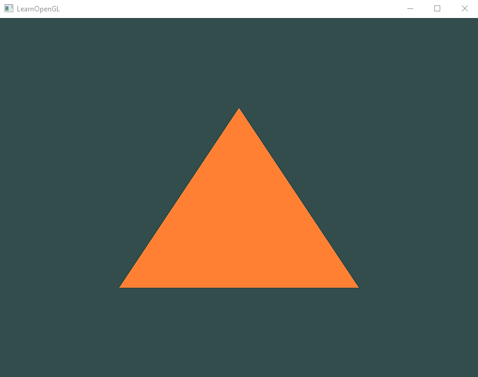

# Setting up a Windows System for OpenGL Development

I prefer the lighter-weight vs-code to edit, and so I have installed this outside of popular IDEs such as Visual Studio.

- [Setting up a Windows System for OpenGL Development](#setting-up-a-windows-system-for-opengl-development)
	- [Overview of OpenGL](#overview-of-opengl)
	- [Prerequisites](#prerequisites)
	- [Installing GLFW](#installing-glfw)
	- [Installing GLAD](#installing-glad)
	- [Testing the Setup](#testing-the-setup)
	- [Test Result](#test-result)

## Overview of OpenGL

- **OpenGL** is an API for giving instructions to a graphics card
  - Since the implementation of these commands will vary based on the system, a library must be built for the device.

- The **Graphics Library Framework (GLFW)** provides a higher-level wrapper for making a device context in order to *"create windows, contexts and surfaces, reading input, handling events, etc."*

- With GLFW, we get a wrapper for interacting with the system, but the actual implementation based on the system specs needs to be defined. The **GLAD** interface handles access to the nitty-gritty graphics driver methods we will need behind the scenes.

## Prerequisites

1. Install **[MinGW](http://mingw-w64.org/doku.php/download)** C++ Compiler
	- Add to *System Path*
		- *`<MinGW-path>/bin`*
		- *`<MinGW-path>/x86_64-w64-mingw32/bin`*
	- Verify Install
		- Open `cmd` or `powershell`
			```shell
			> g++ --version
			```

2. Install **[CMake](https://cmake.org/download/)**
	- Add to *System Path*
		- *`<CMake-path>/bin`*
	- Verify Install
		- Open `cmd` or `powershell`
			```shell
			>cmake --version
			```

## Installing GLFW

1. Downloading GLFW
	
	- Download the **[GLFW *Source Package*](https://www.glfw.org/download.html)**
		- Download the `.zip` to a convenient location such as *`C:\MyPrograms\GL`*
    - **Extract** the files

2. Building GLFW for the System

	- Launch the **CMake-gui**
	- Change the *source code* to the unzipped directory
	- Make a new *build* folder directory like *`glfw-build`* and set this as *destination*
	- *Configure* for *MinGW* and **Generate**
	- Open ***powershell*** or ***cmd*** with Admin privileges into this directory and run:
		```shell
		> make
		```

3. Collecting our GLFW Library and Headers

	- Navigate to the *build* folder and under `src/` find `libglfw3.a`
		- Copy/Paste this file into the project `lib/` directory
	- Navigate to the unzipped downloaded *`/include` destination* directory
		- This folder contains the *glfw* function declarations in headers, which are defined in the *`libglfw3.a`* library for the system
	- Copy the `GLFW` folder with *`glfw3.h`* and *`glfw3native.h`*
		- Paste this folder into the project `include/` directory

**YAY!** - Now we have the GLFW header files with the function definitions in the `include/` folder ready to use, and their exact implementations for the system defined in the `lib/libglfw.a` file.
	
## Installing GLAD

1. Open a GLAD downloader such as  [this page](https://glad.dav1d.de/)
	
	- *Language* as **C++**
	- *Specification* as **OpenGL**
	- *Profile* as **Core**
	- *API* as **Version 3.3** (or higher)
	- Check *Options*: "Generate a oader"
	- Click **"Generate"**
	- **Download** the generated *`.zip`* folder

2. Collecting our GLAD Header Files

	- In the project, create folder `GLAD` in the `include/` directory
	- Locate the downloaded `glad/` directory
	- Under `glad/src/` find `glad.c`
		- Copy/Paste this into the project `include/GLAD/` directory
	- Under `glad/include/glad` find `glad.h`
		- Copy/Paste this into the project `include/GLAD/` directory by `glad.c` (keeping things together is easier)
	- Under `glad/include/` find the `KHR` folder
		- Copy/Paste this folder into the project `include/`
		- For some project needs, this KHR folder is not needed. See [this](https://stackoverflow.com/questions/49683210/what-is-the-khr-platform-header-doing) StackOverflow answer for background on this folder and file.

**YAY!** - Now we can use the GLFW methods, and GLAD will interpret these based on our system drivers.

## Testing the Setup

Now lets make sure this all works! Fingers crossed...

Copy/Paste this code into a `test.cpp` file:

```C++
#include <GLAD/glad.h>
#include <GLFW/glfw3.h>

#include <iostream>

void framebuffer_size_callback(GLFWwindow* window, int width, int height);
void processInput(GLFWwindow *window);

// settings
const unsigned int SCR_WIDTH = 800;
const unsigned int SCR_HEIGHT = 600;

const char *vertexShaderSource = "#version 330 core\n"
	"layout (location = 0) in vec3 aPos;\n"
	"void main()\n"
	"{\n"
	"   gl_Position = vec4(aPos.x, aPos.y, aPos.z, 1.0);\n"
	"}\0";
const char *fragmentShaderSource = "#version 330 core\n"
	"out vec4 FragColor;\n"
	"void main()\n"
	"{\n"
	"   FragColor = vec4(1.0f, 0.5f, 0.2f, 1.0f);\n"
	"}\n\0";

int main()
{
	// glfw: initialize and configure
	// ------------------------------
	glfwInit();
	glfwWindowHint(GLFW_CONTEXT_VERSION_MAJOR, 3);
	glfwWindowHint(GLFW_CONTEXT_VERSION_MINOR, 3);
	glfwWindowHint(GLFW_OPENGL_PROFILE, GLFW_OPENGL_CORE_PROFILE);

#ifdef __APPLE__
	glfwWindowHint(GLFW_OPENGL_FORWARD_COMPAT, GL_TRUE);
#endif

	// glfw window creation
	// --------------------
	GLFWwindow* window = glfwCreateWindow(SCR_WIDTH, SCR_HEIGHT, "LearnOpenGL", NULL, NULL);
	if (window == NULL)
	{
		std::cout << "Failed to create GLFW window" << std::endl;
		glfwTerminate();
		return -1;
	}
	glfwMakeContextCurrent(window);
	glfwSetFramebufferSizeCallback(window, framebuffer_size_callback);

	// glad: load all OpenGL function pointers
	// ---------------------------------------
	if (!gladLoadGLLoader((GLADloadproc)glfwGetProcAddress))
	{
		std::cout << "Failed to initialize GLAD" << std::endl;
		return -1;
	}


	// build and compile our shader program
	// ------------------------------------
	// vertex shader
	unsigned int vertexShader = glCreateShader(GL_VERTEX_SHADER);
	glShaderSource(vertexShader, 1, &vertexShaderSource, NULL);
	glCompileShader(vertexShader);
	// check for shader compile errors
	int success;
	char infoLog[512];
	glGetShaderiv(vertexShader, GL_COMPILE_STATUS, &success);
	if (!success)
	{
		glGetShaderInfoLog(vertexShader, 512, NULL, infoLog);
		std::cout << "ERROR::SHADER::VERTEX::COMPILATION_FAILED\n" << infoLog << std::endl;
	}
	// fragment shader
	unsigned int fragmentShader = glCreateShader(GL_FRAGMENT_SHADER);
	glShaderSource(fragmentShader, 1, &fragmentShaderSource, NULL);
	glCompileShader(fragmentShader);
	// check for shader compile errors
	glGetShaderiv(fragmentShader, GL_COMPILE_STATUS, &success);
	if (!success)
	{
		glGetShaderInfoLog(fragmentShader, 512, NULL, infoLog);
		std::cout << "ERROR::SHADER::FRAGMENT::COMPILATION_FAILED\n" << infoLog << std::endl;
	}
	// link shaders
	unsigned int shaderProgram = glCreateProgram();
	glAttachShader(shaderProgram, vertexShader);
	glAttachShader(shaderProgram, fragmentShader);
	glLinkProgram(shaderProgram);
	// check for linking errors
	glGetProgramiv(shaderProgram, GL_LINK_STATUS, &success);
	if (!success) {
		glGetProgramInfoLog(shaderProgram, 512, NULL, infoLog);
		std::cout << "ERROR::SHADER::PROGRAM::LINKING_FAILED\n" << infoLog << std::endl;
	}
	glDeleteShader(vertexShader);
	glDeleteShader(fragmentShader);

	// set up vertex data (and buffer(s)) and configure vertex attributes
	// ------------------------------------------------------------------
	float vertices[] = {
		-0.5f, -0.5f, 0.0f, // left  
		0.5f, -0.5f, 0.0f, // right 
		0.0f,  0.5f, 0.0f  // top   
	}; 

	unsigned int VBO, VAO;
	glGenVertexArrays(1, &VAO);
	glGenBuffers(1, &VBO);
	// bind the Vertex Array Object first, then bind and set vertex buffer(s), and then configure vertex attributes(s).
	glBindVertexArray(VAO);

	glBindBuffer(GL_ARRAY_BUFFER, VBO);
	glBufferData(GL_ARRAY_BUFFER, sizeof(vertices), vertices, GL_STATIC_DRAW);

	glVertexAttribPointer(0, 3, GL_FLOAT, GL_FALSE, 3 * sizeof(float), (void*)0);
	glEnableVertexAttribArray(0);

	// note that this is allowed, the call to glVertexAttribPointer registered VBO as the vertex attribute's bound vertex buffer object so afterwards we can safely unbind
	glBindBuffer(GL_ARRAY_BUFFER, 0); 

	// You can unbind the VAO afterwards so other VAO calls won't accidentally modify this VAO, but this rarely happens. Modifying other
	// VAOs requires a call to glBindVertexArray anyways so we generally don't unbind VAOs (nor VBOs) when it's not directly necessary.
	glBindVertexArray(0); 


	// uncomment this call to draw in wireframe polygons.
	//glPolygonMode(GL_FRONT_AND_BACK, GL_LINE);

	// render loop
	// -----------
	while (!glfwWindowShouldClose(window))
	{
		// input
		// -----
		processInput(window);

		// render
		// ------
		glClearColor(0.2f, 0.3f, 0.3f, 1.0f);
		glClear(GL_COLOR_BUFFER_BIT);

		// draw our first triangle
		glUseProgram(shaderProgram);
		glBindVertexArray(VAO); // seeing as we only have a single VAO there's no need to bind it every time, but we'll do so to keep things a bit more organized
		glDrawArrays(GL_TRIANGLES, 0, 3);
		// glBindVertexArray(0); // no need to unbind it every time 

		// glfw: swap buffers and poll IO events (keys pressed/released, mouse moved etc.)
		// -------------------------------------------------------------------------------
		glfwSwapBuffers(window);
		glfwPollEvents();
	}

	// optional: de-allocate all resources once they've outlived their purpose:
	// ------------------------------------------------------------------------
	glDeleteVertexArrays(1, &VAO);
	glDeleteBuffers(1, &VBO);
	glDeleteProgram(shaderProgram);

	// glfw: terminate, clearing all previously allocated GLFW resources.
	// ------------------------------------------------------------------
	glfwTerminate();
	return 0;
}

// process all input: query GLFW whether relevant keys are pressed/released this frame and react accordingly
// ---------------------------------------------------------------------------------------------------------
void processInput(GLFWwindow *window)
{
	if (glfwGetKey(window, GLFW_KEY_ESCAPE) == GLFW_PRESS)
		glfwSetWindowShouldClose(window, true);
}

// glfw: whenever the window size changed (by OS or user resize) this callback function executes
// ---------------------------------------------------------------------------------------------
void framebuffer_size_callback(GLFWwindow* window, int width, int height)
{
	// make sure the viewport matches the new window dimensions; note that width and 
	// height will be significantly larger than specified on retina displays.
	glViewport(0, 0, width, height);
}
```

Run the below commands in the terminal:

```shell
# compile the glad.o binary
> g++ include/GLAD/glad.c -g -c -Iinclude -o bin/glad.o
```

```shell
# compile the test.o binary
> g++ test.cpp -g -c -Iinclude -o bin/test.o
```

```shell
# link the object files into the test.exe executable
> g++ bin/glad.o bin/test.o -g -Llib -lglfw3 -lopengl32 -lgdi32 -o bin/test.exe
```

```shell
# run test.exe
> bin/test.exe
```

If you run into compiler issues (I know this can be painful)...

- make sure you have `g++` installed with `> g++ --version`
	- if not, make sure this is listed in the *system path environment variables*
- check that your paths make sense for the project structure
- re-generate your [GLAD headers](#installing-glad)
- re-install the [GLFW libglfw3.a library](#installing-glfw)

## Test Result


